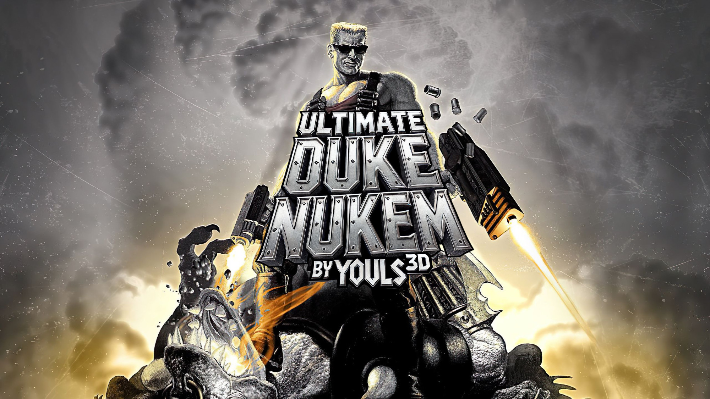
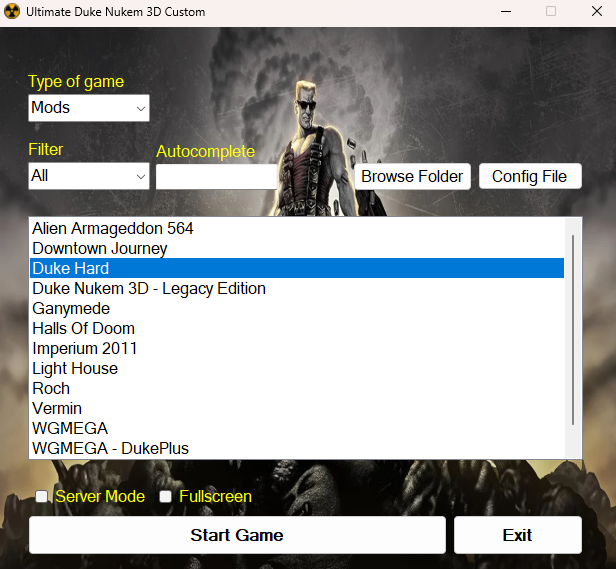

# Using Ultimate Duke Nukem 3D Custom

:warning: **Warning, you must own the original game!** :warning:

"Duke Nukem 3D" original or "Duke Nukem 3D: 20th Anniversary World Tour" on [steam](https://store.steampowered.com/app/434050/Duke_Nukem_3D_20th_Anniversary_World_Tour/) to get the game file: **DUKE3D.GRP**

To use it, simply download the latest realase or [y0uls.com](https://y0uls.com) and install.\
**Run** the "**Ultimate Duke Nukem 3D Custom.exe**" after install and choose the launch options!

Have fun for many hours!

_It is possible to add your custom map for example by running "**Ultimate Duke Nukem 3D Custom.exe**", choose "**Maps**" from the drop-down list then click on "**Browse Folder**"._

_Once in the "maps" folder, create a folder with the name of the map and place the .map file there._

**!! Be careful in the "maps" section, the folders must contain only 1 .map file !!**\
**If there are several maps files, do the same manipulation but in the "mods" section**




# Make Setup With InnoSetup

- Place "CustomDuke", "Ultimate Duke Nukem 3D Custom.exe" and "HtmlAgilityPack.dll" in a zip with the name "UltimateDukeNukem3DCustom.zip"

- Place "UltimateDukeNukem3DCustom.zip" in "MakeSetup" folder

- Run the file "OnlineUDNC.iss", drop "UltimateDukeNukem3DCustom.zip" on an FTP server and change the path in "OnlineUDNC.iss" in "#define UrlZipFile"

- Compile the setup


# Ultimate Duke Nukem 3D Custom.exe Project

**The Visual Studio 2022 folder contains all sources to modify or recompile "Ultimate Duke Nukem 3D Custom.exe"**

# Configuration file

```json
{
    "Config":{
        "PathInstall":"C:\\folder\\game\\Ultimate Duke Nukem 3D Custom"
    },
    "Game":{
        "Difficulty":2,
        "ServerMode":0,
        "Fullscreen":0,
        "ExitAfterStart":0
    }
}
```
- PathInstall : Game installation folder
- Difficulty : The default difficulty mode when launching a map (from 1 to 4). **4 = mob respawn**
- ServerMode : 0 unchecks the default server mode checkbox and 1 checks the default server mode checkbox
- Fullscreen : 0 = 1280x720 and 1 = fullscreen
- ExitAfterStart : 0 leaves the application running and 1 closes it when the game is launched


# Update your maps/mods pack manually

The map/mod zip may be updated from time to time. To download it manually, enter this address: [http://y0uls.com/downloads](https://y0uls.com/downloads) then replace the contents of the "CustomDuke" directory with the new one.

**The "CustomDuke" directory is located in the installation folder you initially chose.**


## Licences

[](https://choosealicense.com/licenses/mit/)
[](https://opensource.org/licenses/)
[](http://www.gnu.org/licenses/agpl-3.0)


## Authors

- [@Y0uls](https://github.com/y0uls)


## Contributor

:heart: A huge thank you to all the contributors, map creator, community, mod developer and so on, for allowing me the creation of this launcher, bringing together all the best custom maps from this iconic game, **Duke Nukem 3D**!
